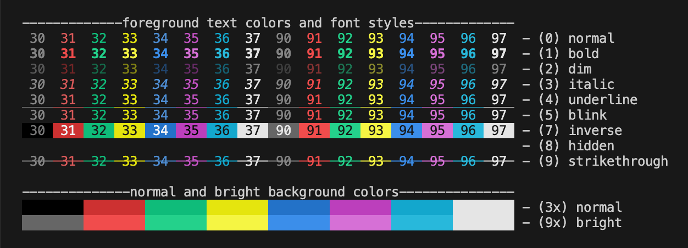

  <picture>
    <source media="(prefers-color-scheme: dark)" srcset="images/banner-dark.png" />
    <source media="(prefers-color-scheme: light)" srcset="images/banner-light.png" />
    
  </picture>

# Zig terminal colors

A simple library for ANSI terminal colors and styles in Zig.

View full demo

  

## Goals

### Non-goals

## Related projects

- [ansi-term](https://github.com/ziglibs/ansi-term) - Zig library for dealing with ANSI Terminals (escape codes, styles, etc.)
- [chameleon](https://github.com/tr1ckydev/chameleon) - Terminal string styling for zig.
- [zig-ansi](https://github.com/nektro/zig-ansi) - ANSI utilities for CLI usage in Zig.
- [mibu](https://github.com/xyaman/mibu) - Pure Zig library for low-level terminal manipulation.

## License

This project is licensed under the MIT License - see the [LICENSE](LICENSE) file for details.
