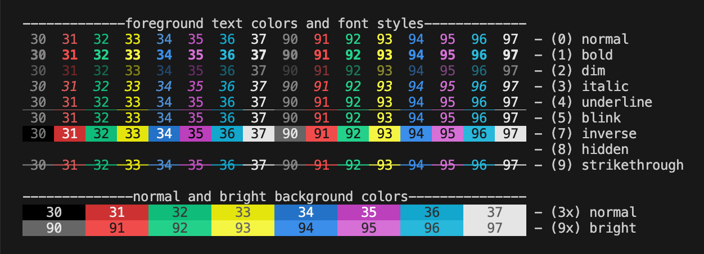

  <picture>
    <source media="(prefers-color-scheme: dark)" srcset="images/banner-dark.png" />
    <source media="(prefers-color-scheme: light)" srcset="images/banner-light.png" />
    
  </picture>

# Zig terminal colors

A simple library for ANSI terminal colors and styles in Zig.

View full demo

  

